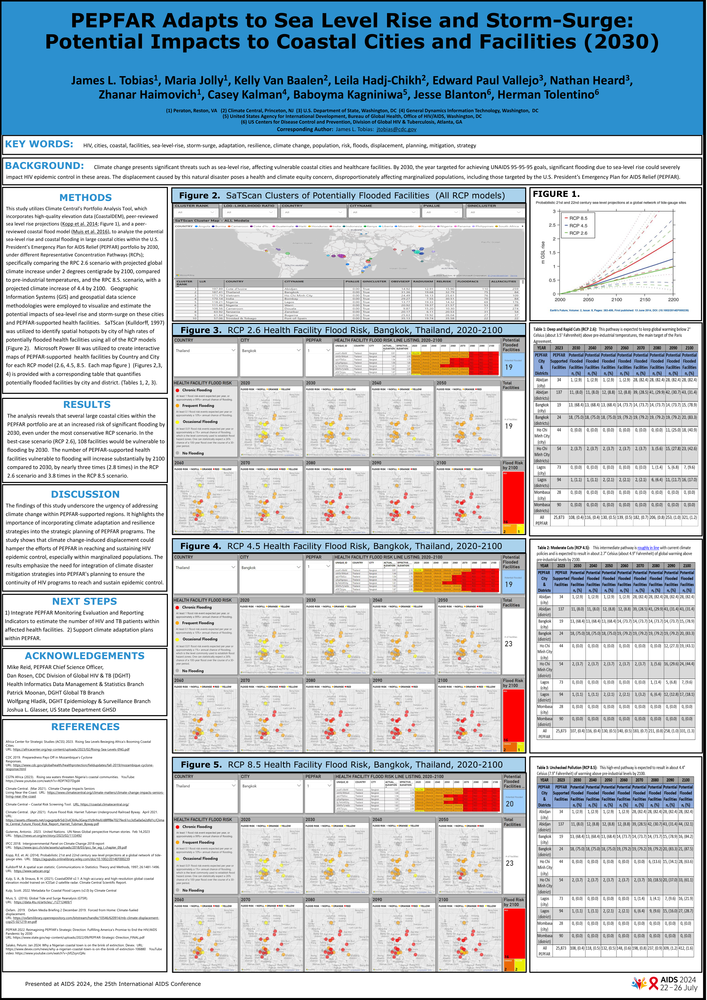
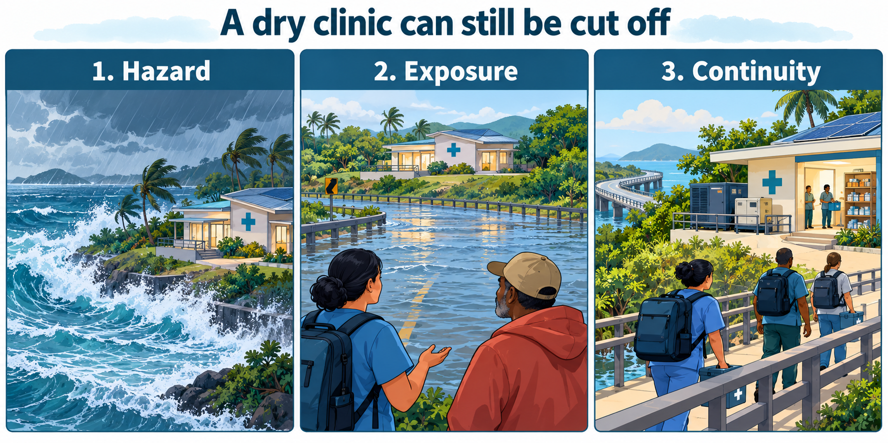

# Coastal Futures: sea-level rise, health facilities & PEPFAR

[](https://github.com/jltobias/JupyterLite-Sea-Level-Rise/actions/workflows/publish.yml)

An interactive **Jupyter Book + JupyterLite** learning environment based on our AIDS 2024 poster. Learn the science, audit the published results, explore three RCP pathways, and build browser-based maps and dashboards for coastal health-service planning.

<a href="https://plus.iasociety.org/sites/default/files/2024-09/e-poster_755.pdf"></a>

**James L. Tobias, Maria Jolly, Kelly Van Baalen, Leila Hadj-Chikh, Edward Paul Vallejo, Nathan Heard, Zhanar Haimovich, Casey Kalman, Baboyma Kagniniwa, Jesse Blanton and Herman Tolentino.** *PEPFAR Adapts to Sea Level Rise and Storm-Surge: Potential Impacts to Coastal Cities and Facilities (2030).* AIDS 2024, poster **THPEF698**, Munich, 22–26 July 2024. [Official IAS poster PDF](https://plus.iasociety.org/sites/default/files/2024-09/e-poster_755.pdf). Preview rendered from that source; original authors and third-party rights holders retain their rights.

## Open the live learning environment

| Experience | Live link |
|---|---|
| Splash page and learning routes | [Coastal Futures](https://jltobias.github.io/JupyterLite-Sea-Level-Rise/) |
| Complete Jupyter Book | [Read the book](https://jltobias.github.io/JupyterLite-Sea-Level-Rise/book/intro.html) |
| Browser Python environment | [Launch JupyterLite](https://jltobias.github.io/JupyterLite-Sea-Level-Rise/lite/lab/index.html?path=notebooks/00_start_here.ipynb) |
| Power BI-style dashboard | [Published evidence and fictional facility labs](https://jltobias.github.io/JupyterLite-Sea-Level-Rise/dashboard/) |
| RCP 2.6 / 4.5 / 8.5 | [2.6](https://jltobias.github.io/JupyterLite-Sea-Level-Rise/dashboard/?scenario=RCP%202.6) · [4.5](https://jltobias.github.io/JupyterLite-Sea-Level-Rise/dashboard/?scenario=RCP%204.5) · [8.5](https://jltobias.github.io/JupyterLite-Sea-Level-Rise/dashboard/?scenario=RCP%208.5) |
| Space–time cube | [Explore the public city histories](https://jltobias.github.io/JupyterLite-Sea-Level-Rise/dashboard/?view=cube) |
| Fictional 3D terrain scene | [Move the water plane through time](https://jltobias.github.io/JupyterLite-Sea-Level-Rise/dashboard/?view=terrain&dataset=synthetic) |
| Reference desk | [Glossary](https://jltobias.github.io/JupyterLite-Sea-Level-Rise/book/glossary.html) · [Data dictionary](https://jltobias.github.io/JupyterLite-Sea-Level-Rise/book/data-dictionary.html) · [Source audit](https://jltobias.github.io/JupyterLite-Sea-Level-Rise/book/source-audit.html) |

The public teaching lessons and dashboard need no account, API key or local Python installation. Viewing the original Power BI report in chapter 13 requires its hosted URL and authorized Microsoft sign-in. In JupyterLite wait for **Python (Pyodide) | Idle** in the status bar, then select **Run → Run All Cells**. If a kernel chooser appears, select **Python (Pyodide)** and press **Select**. The first launch downloads Pyodide and packages; allow a minute on a good connection. Notebook edits stay in browser storage until downloaded. The dashboard runs without Python. WebGL enables 3D views; 2D plots and tables provide alternatives. This deployment is not a fully offline Python distribution.

## Fourteen executable chapters

| # | Notebook / learning goal | Read | Run |
|---|---|---|---|
| 00 | Start here: hazard, exposure and continuity | [Book](https://jltobias.github.io/JupyterLite-Sea-Level-Rise/book/notebooks/00_start_here.html) | [JupyterLite](https://jltobias.github.io/JupyterLite-Sea-Level-Rise/lite/lab/index.html?path=notebooks/00_start_here.ipynb) |
| 01 | Read and audit the entire poster | [Book](https://jltobias.github.io/JupyterLite-Sea-Level-Rise/book/notebooks/01_read_the_poster.html) | [JupyterLite](https://jltobias.github.io/JupyterLite-Sea-Level-Rise/lite/lab/index.html?path=notebooks/01_read_the_poster.ipynb) |
| 02 | Three RCP pathways, baselines and uncertainty | [Book](https://jltobias.github.io/JupyterLite-Sea-Level-Rise/book/notebooks/02_three_rcp_pathways.html) | [JupyterLite](https://jltobias.github.io/JupyterLite-Sea-Level-Rise/lite/lab/index.html?path=notebooks/02_three_rcp_pathways.ipynb) |
| 03 | Probabilities, event rates and thresholds | [Book](https://jltobias.github.io/JupyterLite-Sea-Level-Rise/book/notebooks/03_probability_and_thresholds.html) | [JupyterLite](https://jltobias.github.io/JupyterLite-Sea-Level-Rise/lite/lab/index.html?path=notebooks/03_probability_and_thresholds.ipynb) |
| 04 | Data contracts, tidy panels and map integrity | [Book](https://jltobias.github.io/JupyterLite-Sea-Level-Rise/book/notebooks/04_data_and_geography.html) | [JupyterLite](https://jltobias.github.io/JupyterLite-Sea-Level-Rise/lite/lab/index.html?path=notebooks/04_data_and_geography.ipynb) |
| 05 | Slicers, cards, maps, listings and CSV export | [Book](https://jltobias.github.io/JupyterLite-Sea-Level-Rise/book/notebooks/05_dashboard_lab.html) | [JupyterLite](https://jltobias.github.io/JupyterLite-Sea-Level-Rise/lite/lab/index.html?path=notebooks/05_dashboard_lab.ipynb) |
| 06 | Animated time-series maps and captioned video | [Book](https://jltobias.github.io/JupyterLite-Sea-Level-Rise/book/notebooks/06_time_series_maps.html) | [JupyterLite](https://jltobias.github.io/JupyterLite-Sea-Level-Rise/lite/lab/index.html?path=notebooks/06_time_series_maps.ipynb) |
| 07 | 3D terrain, water surfaces and sensitivity | [Book](https://jltobias.github.io/JupyterLite-Sea-Level-Rise/book/notebooks/07_three_dimensions.html) | [JupyterLite](https://jltobias.github.io/JupyterLite-Sea-Level-Rise/lite/lab/index.html?path=notebooks/07_three_dimensions.ipynb) |
| 08 | Space–time cubes and heatmaps | [Book](https://jltobias.github.io/JupyterLite-Sea-Level-Rise/book/notebooks/08_space_time_cube.html) | [JupyterLite](https://jltobias.github.io/JupyterLite-Sea-Level-Rise/lite/lab/index.html?path=notebooks/08_space_time_cube.ipynb) |
| 09 | Fictional spatial scan and permutation test | [Book](https://jltobias.github.io/JupyterLite-Sea-Level-Rise/book/notebooks/09_hotspots.html) | [JupyterLite](https://jltobias.github.io/JupyterLite-Sea-Level-Rise/lite/lab/index.html?path=notebooks/09_hotspots.ipynb) |
| 10 | Service networks, adaptation and equity | [Book](https://jltobias.github.io/JupyterLite-Sea-Level-Rise/book/notebooks/10_continuity_and_equity.html) | [JupyterLite](https://jltobias.github.io/JupyterLite-Sea-Level-Rise/lite/lab/index.html?path=notebooks/10_continuity_and_equity.ipynb) |
| 11 | Capstone briefing with worked checks and rubric | [Book](https://jltobias.github.io/JupyterLite-Sea-Level-Rise/book/notebooks/11_capstone.html) | [JupyterLite](https://jltobias.github.io/JupyterLite-Sea-Level-Rise/lite/lab/index.html?path=notebooks/11_capstone.ipynb) |
| 12 | Reproduction boundaries and approved-data extension | [Book](https://jltobias.github.io/JupyterLite-Sea-Level-Rise/book/notebooks/12_reproduce_and_extend.html) | [JupyterLite](https://jltobias.github.io/JupyterLite-Sea-Level-Rise/lite/lab/index.html?path=notebooks/12_reproduce_and_extend.ipynb) |
| 13 | Original Power BI report: API metadata and browser viewer | [Book](https://jltobias.github.io/JupyterLite-Sea-Level-Rise/book/notebooks/13_powerbi_in_browser.html) | [JupyterLite](https://jltobias.github.io/JupyterLite-Sea-Level-Rise/lite/lab/index.html?path=notebooks/13_powerbi_in_browser.ipynb) |

Every chapter includes objectives, executable examples, interpretation, a lab and a worked answer/check. The [teaching guide](book/teaching-guide.md) provides workshop routes and accessibility guidance. The visual collection includes 2D maps, 3D geographic stems, a fictional terrain scene, animated decade maps, space–time cubes, heatmaps, uncertainty plots, a service-network graph, a captioned MP4 and a sense-making comic.



*AI-generated conceptual illustration, created with the built-in image-generation tool. [Exact prompt and provenance](content/assets/visual-provenance.json). Fictional people and places, not evidence of an event.*

## Connect the original Power BI report

[Chapter 13](https://jltobias.github.io/JupyterLite-Sea-Level-Rise/book/notebooks/13_powerbi_in_browser.html) uses [`python-power-bi==0.1.2`](https://pypi.org/project/python-power-bi/) for metadata and a [secure Microsoft viewer](https://learn.microsoft.com/en-us/power-bi/collaborate-share/service-embed-secure) for the original report. The package cannot render a local PBIX in JupyterLite. Paste the published report's **Website or portal** URL into the notebook and choose an RCP page. The default run exercises the actual package against labeled offline fixtures; no report is currently connected. Optional authenticated API discovery runs in local/server Python.

The notebook also compares Microsoft's [`powerbiclient`](https://learn.microsoft.com/en-us/javascript/api/overview/powerbi/powerbi-jupyter), which embeds hosted reports, and [`PBIXRay`](https://pypi.org/project/pbixray/), which reads model data but does not render visuals. No PBIX, tokens or facility records are added to the public site. [Page catalog](content/data/powerbi-report.json) · [Integration helper](content/powerbi_bridge.py).

## Published evidence and fictional labs

- **Published layer:** 264 transcribed rows from poster Tables 1–3: 3 RCPs × 8 decades × 11 reporting rows. Includes five city/district pairs and a separate whole-portfolio total. City map pins are approximate contextual anchors, never facility coordinates.
- **Fictional layer:** 192 independently generated facilities across eight city anchors; 5,184 scenario/year records. Coordinates, elevations, service loads, support flags and probabilities are invented, not masked or jittered versions of real records. [Generator](scripts/generate_data.py), seed 20240722.
- **Reference layer:** six global IPCC AR5 sea-level rows with explicit baseline and period; these are not the poster's local PAT projections.
- **Verified source consistency:** local workbook filtering reproduces all 24 published portfolio totals. No private workbook, PBIX/PBIP cache, DATIM UID, real facility coordinate or patient record is published.
- **Known discrepancy:** Table 1 yields 321/108 ≈ **2.97×**, while the narrative reports **2.8×**. Both remain visible with labels. Percentages are recomputed from counts. The original model cannot be fully rerun without licensed inputs and detailed settings. See the [source audit](book/source-audit.md).

| Projection year | RCP 2.6 | RCP 4.5 | RCP 8.5 |
|---|---:|---:|---:|
| 2030 | 108 | 107 | 108 |
| 2100 | 321 | 331 | 412 |

These are **published potentially flooded facilities**, with a fixed 2023 supported-portfolio denominator of **25,873**. Exposure is not observed flooding, service interruption or patient impact. RCPs are pathways, not three individual climate models. City and district scopes must not be added together.

## Data citations, licenses and attribution

The table below covers the inputs used or discussed. Full bibliographic details, historical contextual references and rights notes are in [References](book/references.md). Source metadata, transformations and SHA-256 hashes are in [provenance.json](content/data/provenance.json). Inspected 2026-10-04.

| Source / material | Role and citation | License and attribution requirements |
|---|---|---|
| AIDS 2024 poster | Tobias et al. (2024), THPEF698. [Official PDF](https://plus.iasociety.org/sites/default/files/2024-09/e-poster_755.pdf); [public transcription](content/data/poster_aggregates.csv) | No open license verified for composite poster. Original rights retained; cite authors/conference/table/link. Poster artwork and embedded figures excluded from repository licenses. Preview included at presenting author's request. |
| Original PEPFAR facility portfolio / Power BI / PPTX | User-supplied source files inspected locally for schema and aggregate validation | Sensitive/provider-governed source data, not distributed or relicensed. Anonymized IDs do not make precise coordinates open data. Obtain data-owner authorization for additional releases. |
| Power BI page catalog | 18 page names/captions/order from the supplied PBIX's `Report/Layout`, inspected 2026-10-05 | Descriptive metadata only; original report/data rights retained. No facility values, credentials or report binary included. |
| python-power-bi 0.1.2 | Alex Reed; [PyPI](https://pypi.org/project/python-power-bi/), [upstream](https://github.com/areed1192/power-bi-python-api) | MIT; retain the [2020 Alex Reed notice](licenses/python-power-bi-MIT.txt). MSAL and requests retain their own licenses. Power BI service and report access have separate terms. |
| Kopp et al. (2014) | *Probabilistic 21st and 22nd century sea-level projections at a global network of tide-gauge sites*, Earth's Future 2, 383–406. [DOI](https://doi.org/10.1002/2014EF000239) | Cite paper/DOI. No raw projection grids distributed; publisher and dataset terms apply. |
| Muis et al. (2016) / GTSR | *A global reanalysis of storm surges and extreme sea levels*, Nature Communications 7, 11969. [DOI](https://doi.org/10.1038/ncomms11969), [4TU record](https://data.4tu.nl/articles/_/12712469/1) | Reference only. Cite paper and data version if used. Exact repository license/access must be verified before redistribution; record could not be independently opened during this build. |
| CoastalDEM v2.1 | Kulp & Strauss (2021), Climate Central. [Version page](https://www.climatecentral.org/coastaldem-v2.1) | Product terms apply; not bundled. Cite authors/product/version and satisfy provider license. |
| Climate Central PAT / coastal flood layers | [Data products](https://www.climatecentral.org/data-products), [screening tool](https://coastal.climatecentral.org/); Kulp (2022), *Metadata for Coastal Flood Layers v2.0* | Licensed/provider-controlled products; no raw layers bundled. Obtain metadata and redistribution permission; a free viewer is not a raw-data license. |
| IPCC AR5 global reference values | IPCC (2013), WGI SPM, Table SPM.2, p. 23. [PDF](https://www.ipcc.ch/site/assets/uploads/2018/02/WG1AR5_SPM_FINAL.pdf), [CSV](content/data/ipcc_ar5_reference.csv) | Cite assessment/table/baseline. IPCC retains report rights; [copyright policy](https://www.ipcc.ch/copyright/). Numeric facts re-plotted; no independent open license claimed over source material. |
| IPCC AR6 context | IPCC (2021), WGI [Summary for Policymakers](https://www.ipcc.ch/report/ar6/wg1/chapter/summary-for-policymakers/) | Citation/link only; IPCC terms apply. No SSP dataset substituted for the historical RCP analysis. |
| SaTScan methodology | Kulldorff (1997), *A spatial scan statistic*. [DOI](https://doi.org/10.1080/03610929708831995), [documentation](https://www.satscan.org/techdoc.html) | Cite method/software when used. SaTScan is not bundled; independent teaching scan is MIT and is not a replication claim. |
| UNAIDS target definitions | UNAIDS (2024), [Understanding measures of progress towards 95–95–95](https://www.unaids.org/en/resources/documents/2024/progress-towards-95-95-95) | Cite source; no report reproduced. Explains 2025 targets within the 2030 agenda. |
| PEPFAR strategy | PEPFAR (2022), [Reimagining PEPFAR's Strategic Direction](https://www.state.gov/wp-content/uploads/2022/09/PEPFAR-Strategic-Direction_FINAL.pdf) | Historical reference link; source and component rights retained. No current-policy assertion or agency endorsement. |
| Natural Earth land v5.1.2 | [Pinned 1:110m GeoJSON](https://github.com/nvkelso/natural-earth-vector/blob/v5.1.2/geojson/ne_110m_land.geojson) | [Public domain](https://www.naturalearthdata.com/about/terms-of-use/). Attribution not required; voluntarily credited “Made with Natural Earth.” Too coarse for local hazard assessment. |
| Fictional facilities and exposure data | This repository; deterministic [generator](scripts/generate_data.py) | CC0-1.0 to extent applicable rights exist. Cite repo/version for reproducibility and retain fictional labels. No patient/clinical interpretation. |
| Original code | Python, JavaScript, HTML/CSS, generators and tests | [MIT](LICENSE); retain copyright/license. |
| Original educational prose, diagrams and generated video | Repository contributors; MP4 generated from explicit toy curves, caption track included | [CC BY 4.0](https://creativecommons.org/licenses/by/4.0/); credit creators/repository, link license and indicate changes. No external footage/music bundled. |
| AI-generated comic | [Prompt, built-in tool mode and provenance](content/assets/visual-provenance.json) | CC0 to extent applicable rights are held. Preserve conceptual/AI-generated disclosure; no real-person/event/endorsement claim. |
| Plotly.js and notebook stack | Bundled Plotly.js; JupyterLite, Pyodide, Jupyter Book, pandas, NumPy, Matplotlib, ipywidgets | Upstream licenses retained. Plotly.js MIT notice in [licenses](licenses/plotly-js-MIT.txt); dependency versions in [build environment](build-environment.txt). See [full software notes](book/references.md). |

Other poster references, linked for context only (original publishers retain rights): [ACSS (2023), rising seas and African cities](https://africacenter.org/wp-content/uploads/2023/02/Rising-Sea-Levels-ENG.pdf); [CDC (2019), Mozambique cyclone response](https://www.cdc.gov/globalhealth/healthprotection/fieldupdates/fall-2019/mozambique-cyclone-response.html); [CGTN Africa video](https://www.youtube.com/watch?v=RDP7KD7Dgd4); [Climate Central (2021), coastal seniors](https://www.climatecentral.org/climate-matters/climate-change-impacts-seniors-living-near-the-coast); [Harriet Tubman Byway flood report](https://assets.ctfassets.net/cxgxgstp8r5d/2ivlC6tAu3GeqctYz9nNxX/d8fff8e7027fec61cc3d5a0a5e2dfd1c/Climate_Central_Future_Flood_Risk_Report_Harriet_Tubman_Byway.pdf); [UN News (2023)](https://news.un.org/en/story/2023/02/1133492); [Oxfam (2019), Forced from Home](https://oxfamilibrary.openrepository.com/bitstream/handle/10546/620914/mb-climate-displacement-cop25-021219-en.pdf); [Salako/Devex (2024), Ayetoro](https://www.devex.com/news/why-a-nigerian-coastal-town-is-on-the-brink-of-extinction-106880) and [associated video](https://www.youtube.com/watch?v=jVEZsyrcQAs). The poster's “IPCC 2018” link actually points to [FAR WGI Chapter 9](https://www.ipcc.ch/site/assets/uploads/2018/03/ipcc_far_wg_I_chapter_09.pdf); the book documents this dating issue. Historical URLs may redirect or be retired. External videos are linked rather than copied.

## Build, verify and publish

```bash
python -m venv .venv
# Activate the environment; Windows: .venv\Scripts\Activate.ps1
# macOS/Linux: source .venv/bin/activate
python -m pip install -r requirements.txt
python -m pytest tests -q
python scripts/build.py
python scripts/check_site.py
python -m http.server 8000 --directory _site
```

Open `http://localhost:8000`. The build executes all 14 notebooks, builds a Jupyter Book v1 site, assembles the dashboard and builds/checks JupyterLite. The **GitHub Actions** workflow publishes `_site/` to GitHub Pages after checks pass. Pages source must be **GitHub Actions**. [Deployment runs](https://github.com/jltobias/JupyterLite-Sea-Level-Rise/actions/workflows/publish.yml).

Rebuild authored lesson sources with `python scripts/make_notebooks.py`; regenerate fictional data with `python scripts/generate_data.py`; regenerate the public transcription with `python scripts/transcribe_poster.py`. None reads private study inputs. `scripts/generate_media.py` regenerates the original MP4/still/captions. After changing data or media, run `python scripts/update_provenance.py` to refresh integrity hashes. The optional authorized local workbook audit is documented in [source-audit.md](book/source-audit.md) and requires `openpyxl`.

For browser regression checks: install `playwright`, run `python -m playwright install chromium`, then `python scripts/browser_smoke.py` while the local server is running. Tests cover public totals, country/city filters, fictional cohort counts, threshold monotonicity, 3D modes and CSV export. See [VALIDATION.md](VALIDATION.md) for the delivered build's checks and remaining limits.

## Repository layout

```text
content/notebooks/   14 executable chapters with saved outputs
content/data/        public aggregates, fictional fixtures, reference data, provenance
content/assets/      poster preview, comic, local chart bundle, video and captions
content/coastlab.py  shared transparent teaching calculations
content/powerbi_bridge.py  report metadata and browser viewer helpers
book/                Jupyter Book configuration, glossary, dictionary, sources
dashboard/           standalone browser dashboard
scripts/             generators, local audit, build and validation
tests/               scientific/data-contract regression checks
.github/workflows/   build, verify and deploy to GitHub Pages
```

[License scope](LICENSES.md) · [Cite this repository](CITATION.cff) · [Full references](book/references.md). This educational adaptation does not imply endorsement by PEPFAR, CDC, IAS, Climate Central or any author's institution.
